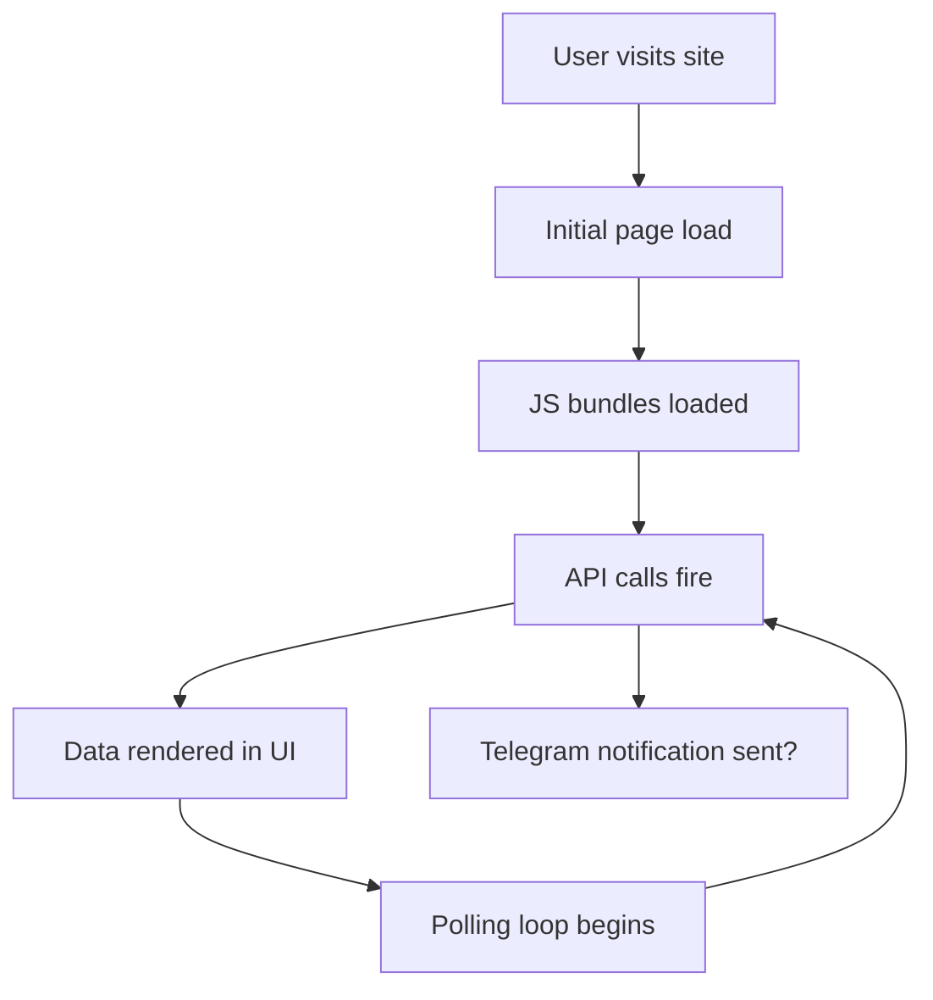

# 🧠 Ultimate Web Intelligence & Reverse Engineering Lab

## 🎯 Mission

Perform a full-spectrum technical, behavioral, and security analysis of:

**Target:** https://worldviewosint.com/

Work out of this GitHub repo. All logs, scripts, captures, and reports are stored here.

You will behave as an autonomous:

- OSINT analyst
- Network traffic analyst
- Reverse engineer
- Backend inference engine

Your goal is to **capture, analyze, reconstruct, and classify** every observable behavior, data source, and communication channel used by the target system.

---

<!-- STATUS-ROADMAP:START -->
## Status & Roadmap

**Status:** Mature, complete OSINT/security-recon dossier — the evidence archive (captures, logs, recon notes, and analysis reports) is finished and validates cleanly; methodology coverage is complete (all phases executed). Health: stabilizing.

**In progress / known issues:**
- Reproducibility hardening: the standalone Python recon scripts use hardcoded local paths and need to be made clone-relative so they run on any checkout.
- No dependency manifest yet: a `requirements.txt` is needed for the third-party Python deps (e.g. `shodan`, plus its `SHODAN_API_KEY` env var).
- Documentation drift: a few paths in the docs do not match the actual tree (the Playwright capture script is `scripts/browser_capture.js`).
- Packaging hygiene: `package.json` needs `name`/`version` and a documented Playwright install so it does not rely on a globally installed copy.

**Roadmap:**
- Add a Python dependency manifest (`requirements.txt`/`pyproject`) listing every third-party dep actually imported, with an env-var reference.
- Reconcile the docs with the real tree (correct script names; remove or create the listed-but-missing helper files).
- Tidy `package.json` (add `name`/`version`, regenerate the lockfile) and document the two-step Playwright install.
- Cross-link findings to the public `vibe-coding-website-security` playbook taxonomy as live case-study instances.
- Add a short note clarifying the intended repo-name spelling (`worldviewosnit`) versus the target (`worldviewosint`).
- Continue responsible-hardening framing: keep findings as vulnerability-class case studies and fixes rather than step-by-step recipes.
<!-- STATUS-ROADMAP:END -->

---

# ⚠️ Operating Principles

- Operate autonomously — minimize manual intervention
- Log ALL observable data — nothing is irrelevant until proven otherwise
- Focus on observation, inference, reconstruction
- Prefer evidence over assumptions — cite specific requests, headers, payloads
- Remain low-noise during probing — no aggressive scanning, no brute-force
- Document every finding as you go, not after the fact
- If a phase produces no results, log that explicitly (absence of evidence is data)

---

# 📁 PROJECT STRUCTURE

Maintain this directory layout in the repo root:

```
worldviewosnit/
├── README.md
├── captures/
│   ├── traffic.har              # HAR capture from Playwright
│   ├── traffic_dump.mitm        # Raw mitmproxy dump
│   └── network.json             # Parsed request/response log
├── scripts/
│   ├── browser_capture.js       # Playwright automation script
│   ├── replay.sh                # API replay script
│   └── analyze.py               # Log analysis / correlation
├── logs/
│   ├── endpoints.json           # Discovered endpoints + status codes
│   ├── telegram.json            # Telegram-specific traffic
│   ├── cookies.json             # Cookie inventory
│   └── console.json             # Browser console output
├── recon/
│   ├── dns.txt                  # WHOIS + DNS records
│   ├── tls.txt                  # TLS certificate details
│   ├── subdomains.txt           # Subdomain enumeration results
│   └── source-analysis.md       # JavaScript / source map findings
├── reports/
│   ├── architecture.md          # Architecture diagram
│   ├── api-map.md               # Full endpoint map
│   ├── telegram-report.md       # Telegram forensics report
│   ├── data-authenticity.md     # Signal validation report
│   ├── backend-fingerprint.md   # Stack identification
│   ├── security-assessment.md   # Risk assessment
│   └── final-classification.md  # System intent + verdict
└── tools/
    └── setup.sh                 # Automated toolchain installer
```

---

# 🧰 TOOLCHAIN SETUP

Install all tools before beginning. Verify each installation before proceeding.

## Core

- **Node.js** (latest LTS) — `node --version`
- **Python 3.11+** — `python --version`
- **jq** — JSON processing — `jq --version`
- **curl** — HTTP requests — `curl --version`
- **httpie** — human-readable HTTP — `http --version`

## Browser Automation

- **Playwright** — `npx playwright --version`
- **Chromium** — installed via Playwright: `npx playwright install chromium`

## Network Interception

- **mitmproxy** (v10+) — `mitmproxy --version`

> **Note:** The `-w` flag is deprecated in mitmproxy v10+. Use `--save-stream-file` or `mitmdump -w` instead.

## DNS / Domain Recon

- **whois** — domain registration lookup
- **dig** or **nslookup** — DNS record queries
- **subfinder** (optional) — subdomain enumeration
- **openssl** — TLS certificate inspection

## Optional

- **tcpdump** / **Wireshark** — low-level packet capture
- **Wappalyzer CLI** or **webanalyze** — technology fingerprinting

## Verification

Run the following to confirm the toolchain is ready:

```bash
node --version && python3 --version && jq --version && curl --version | head -1 && mitmproxy --version && npx playwright --version
```

All tools must return valid version numbers before proceeding to Phase 1.

---

# 🌐 ARCHITECTURE STACK

```
[Agent]
  ↓
[Playwright Automation]
  ↓
[Chromium Browser (headless or headed)]
  ↓
[mitmproxy Interception Layer — 127.0.0.1:8080]
  ↓
[Target Site + APIs + Third-Party Endpoints (Telegram, CDNs, etc.)]
```

Data flows downward. Every layer captures and logs. mitmproxy sees all HTTPS traffic after certificate trust is established.

---

# 🧪 PHASE 0 — ENVIRONMENT PREPARATION

Before touching the target, prepare a clean analysis environment.

## Operational Security

1. **Use a VPN or isolated network** — your real IP will be logged by the target (especially if it phones home to Telegram)
2. **Use a clean browser profile** — no cookies, no extensions, no saved logins
3. **Dedicated workspace** — clone this repo, work exclusively inside it
4. **No authentication** — do NOT log into anything on the target; observe as an anonymous visitor

## Environment Checklist

- [ ] VPN active and verified (check IP at https://ifconfig.me)
- [ ] Toolchain installed and verified (see above)
- [ ] Repo cloned and directory structure created
- [ ] mitmproxy CA certificate NOT yet trusted (do that in Phase 2)
- [ ] Browser profile is clean / fresh

---

# 🧪 PHASE 1 — DNS & DOMAIN RECONNAISSANCE

Before intercepting traffic, gather passive intelligence about the target's infrastructure.

## 1.1 — WHOIS Lookup

```bash
whois worldviewosint.com > recon/dns.txt
```

Extract:
- Registrar
- Registration / expiration dates
- Registrant info (or privacy service)
- Name servers

## 1.2 — DNS Records

```bash
dig worldviewosint.com ANY +noall +answer >> recon/dns.txt
dig worldviewosint.com A >> recon/dns.txt
dig worldviewosint.com AAAA >> recon/dns.txt
dig worldviewosint.com CNAME >> recon/dns.txt
dig worldviewosint.com MX >> recon/dns.txt
dig worldviewosint.com TXT >> recon/dns.txt
dig worldviewosint.com NS >> recon/dns.txt
```

Look for:
- **CNAME to Vercel/Netlify/Cloudflare** → hosting provider
- **TXT records** → SPF, DKIM, domain verification tokens (Google, etc.)
- **MX records** → email infrastructure (or lack thereof)

## 1.3 — Subdomain Enumeration

```bash
subfinder -d worldviewosint.com -o recon/subdomains.txt
```

Or manually check common subdomains:

```bash
for sub in www api app admin dev staging mail; do
  dig +short "$sub.worldviewosint.com" >> recon/subdomains.txt
done
```

## 1.4 — TLS Certificate Analysis

```bash
echo | openssl s_client -connect worldviewosint.com:443 -servername worldviewosint.com 2>/dev/null | openssl x509 -noout -text > recon/tls.txt
```

Extract:
- Issuer (Let's Encrypt → likely automated; Cloudflare → CDN-proxied)
- Subject Alternative Names (SANs) — may reveal related domains
- Validity period
- Certificate chain

## 1.5 — Passive Observations

Note:
- Does the domain resolve to a CDN (Cloudflare, Vercel, AWS CloudFront)?
- Are there any CAA records restricting certificate issuance?
- Does the IP belong to a known hosting provider? (`whois <IP>`)

Save all output to `recon/dns.txt` and `recon/tls.txt`.

---

# 🧪 PHASE 2 — NETWORK INTERCEPTION SETUP

## 2.1 — Start mitmproxy

```bash
mitmdump --save-stream-file captures/traffic_dump.mitm
```

This starts the proxy on `127.0.0.1:8080` by default and writes all traffic to the dump file.

> For interactive inspection during capture, use `mitmweb` instead of `mitmdump` — it provides a browser-based UI at `http://127.0.0.1:8081`.

## 2.2 — Install and Trust the mitmproxy CA Certificate

1. With mitmproxy running, open a browser and navigate to: `http://mitm.it`
2. Download the certificate for your OS
3. Trust the certificate:
   - **macOS:** Add to Keychain Access → System → "Always Trust"
   - **Windows:** Install to "Trusted Root Certification Authorities"
   - **Linux:** Copy to `/usr/local/share/ca-certificates/` and run `sudo update-ca-certificates`

## 2.3 — Verify Interception

```bash
curl --proxy http://127.0.0.1:8080 https://worldviewosint.com/ -o /dev/null -w "%{http_code}" -s
```

Expected: HTTP `200`. If you get a certificate error, the CA cert is not trusted correctly. Fix before proceeding.

---

# 🧪 PHASE 3 — FULL TRAFFIC CAPTURE

Launch Chromium via Playwright with the mitmproxy proxy enabled. Capture everything.

## What to Capture

- XHR / fetch requests
- WebSocket connections and frames
- Script loads (JS bundles, chunks)
- Stylesheet and font loads
- Image / media requests
- Third-party API calls (analytics, CDNs, Telegram, etc.)
- Service Worker registrations and fetch events

## What to Log for Each Request/Response

| Field | Description |
|-------|-------------|
| `url` | Full request URL |
| `method` | HTTP method (GET, POST, etc.) |
| `headers` | All request and response headers |
| `request_body` | POST/PUT body (if any) |
| `response_body` | Response content |
| `status` | HTTP status code |
| `content_type` | Response content type |
| `timestamp` | Unix timestamp (ms) |
| `duration` | Time from request to response (ms) |
| `initiator` | What triggered the request (script, user action, etc.) |

## Output Files

- `captures/network.json` — structured request/response log
- `captures/traffic.har` — HAR format for browser devtools import
- `logs/console.json` — browser console output (errors, warnings, logs)

---

# 🧪 PHASE 4 — BEHAVIOR SIMULATION

Simulate realistic user behavior to trigger all network activity the site is capable of producing.

## Interaction Sequence

1. **Initial page load** — observe all requests fired on first visit
2. **Wait 30 seconds** — watch for background polling, WebSocket connections, delayed XHR calls
3. **Scroll the full page** — some content lazy-loads or triggers on scroll
4. **Click all interactive elements:**
   - Buttons, toggles, tabs, dropdowns
   - Map interactions (zoom, pan, click markers)
   - Any navigation links / route changes
5. **Hover over interactive elements** — tooltips, popups, info panels
6. **Resize the browser window** — responsive breakpoints may load different assets or APIs
7. **Navigate to all visible routes/pages** — capture each page's network activity independently
8. **Wait another 30 seconds after all interactions** — catch any delayed or periodic calls
9. **Repeat the full sequence once** — compare traffic patterns for consistency

## What to Watch For

- Requests that fire on a timer (polling intervals)
- Requests that fire on specific user actions only
- WebSocket messages that arrive without user interaction
- Differences between first-load and subsequent-load traffic
- Requests to domains other than the target (third-party calls)

---

# 🧪 PHASE 5 — DATA LOGGING & ORGANIZATION

Structure all captured data for analysis.

## Structured Outputs

1. **Unique endpoints list** — deduplicated, sorted by domain, then path
2. **Grouped responses by endpoint** — all responses for each endpoint in chronological order
3. **Frequency tracking** — how often each endpoint is called per minute
4. **Payload size tracking** — request and response sizes per endpoint
5. **Timeline view** — all requests plotted on a timeline (use timestamps)

## Deduplication Rules

- Same URL + same method + same request body = duplicate (keep first occurrence, count total)
- Same URL + different query params = separate entries
- Same URL + different response body = track as "dynamic" endpoint

## File Format

All logs as JSON arrays. Example entry:

```json
{
  "url": "https://worldviewosint.com/api/data",
  "method": "GET",
  "status": 200,
  "content_type": "application/json",
  "request_headers": {},
  "response_size": 4523,
  "timestamp": 1716300000000,
  "duration_ms": 142,
  "occurrence_count": 5,
  "classification": "REAL-TIME API"
}
```

---

# 🧪 PHASE 6 — TELEGRAM FORENSICS (CRITICAL)

This is the highest-priority analysis phase. The target may be exfiltrating visitor data to Telegram.

## Detection

Filter all captured traffic for any requests to:

```
api.telegram.org
```

Also check for:
- Obfuscated Telegram calls (base64-encoded URLs, proxied through the target's own backend)
- References to `t.me` or `telegram` in JavaScript source code

## For EACH Telegram Request, Extract:

### URL Structure

Telegram Bot API URLs follow this pattern:
```
https://api.telegram.org/bot<BOT_TOKEN>/<METHOD>
```

Extract:
- **Bot token** — the string between `bot` and `/` (e.g., `bot123456:ABC-DEF...`)
- **Method** — the API method called (e.g., `sendMessage`, `sendPhoto`, `sendDocument`)

### Request Payload

- `chat_id` — the target chat/channel/group
  - Positive number = individual user
  - Negative number = group chat
  - `-100` prefix = supergroup or channel
- `text` — message content (may contain visitor data)
- `parse_mode` — formatting mode (HTML, Markdown)
- Any file attachments or media

### Response

- `ok` field (boolean)
- `result.message_id` — confirms message was sent
- Error messages if failed

## Bot Identity Verification

Using the extracted bot token, query:

```bash
curl https://api.telegram.org/bot<TOKEN>/getMe
```

This reveals:
- Bot username
- Bot display name
- Whether it can join groups
- Whether it's a public bot

## Determine for Each Call

| Question | How to Answer |
|----------|--------------|
| What triggers it? | Correlate timestamp with user action timeline from Phase 4 |
| How often? | Count occurrences, check for interval patterns |
| What data is sent? | Parse the `text` field and any attached data |
| Does it include visitor IP? | Check text content and any headers forwarded |
| Does it include user agent? | Check text content |
| Does it include interaction data? | Check if click/scroll events are referenced |
| Is it one-way logging or bidirectional? | Check for any response-dependent behavior |

## Classification

Classify the Telegram integration as:

- **Visitor logging** — sends data about each visitor (IP, UA, etc.)
- **Alert system** — sends notifications on specific events
- **Analytics/tracking** — aggregates and reports interaction data
- **C2 (command and control)** — receives instructions from Telegram (check for polling of `getUpdates`)
- **Exfiltration** — sends sensitive or identifiable data without user consent

---

# 🧪 PHASE 7 — ENDPOINT DISCOVERY

Go beyond observed endpoints. Probe for hidden or undocumented paths.

## Step 1 — Harvest from Observed Traffic

From Phase 3-5 captures, extract all unique URL paths. These are your known endpoints.

## Step 2 — Check Standard Discovery Files

```bash
curl -s https://worldviewosint.com/robots.txt
curl -s https://worldviewosint.com/sitemap.xml
curl -s https://worldviewosint.com/.well-known/security.txt
curl -s https://worldviewosint.com/.well-known/openapi.json
```

## Step 3 — Probe Common Framework Paths

Based on the stack inferred in Phase 1 (DNS) and Phase 10 (Fingerprinting), probe paths relevant to the detected framework:

### General
```
/api/
/api/v1/
/api/v2/
/internal/
/debug/
/admin/
/health
/healthcheck
/status
/metrics
/graphql
/.env
/config.json
```

### Next.js Specific
```
/_next/data/
/api/hello
/_next/static/
/__nextjs_original-stack-frame
```

### Python/FastAPI Specific
```
/docs
/redoc
/openapi.json
```

### Vercel Specific
```
/.vercel/
/_vercel/insights/script.js
```

## Step 4 — Log Results

For each probed path, record:

| Field | Value |
|-------|-------|
| Path | URL path |
| Status Code | HTTP response code |
| Response Size | Content-Length or body length |
| Content-Type | Response type |
| Classification | `valid` / `hidden` / `redirect` / `error` / `dead` |

## Rate Limiting

- Wait **500ms between requests** — do not hammer the server
- If you receive `429 Too Many Requests`, back off and note the rate limit headers
- If you receive `403 Forbidden`, log it but do not retry with bypass techniques

Save results to `logs/endpoints.json`.

---

# 🧪 PHASE 8 — CLIENT-SIDE CODE ANALYSIS

Analyze the JavaScript bundles, source maps, and client-side storage used by the target.

## 8.1 — JavaScript Bundle Analysis

From the captured traffic (Phase 3), extract all `.js` files loaded by the site.

For each bundle:
- Note the filename pattern (hashed chunks = Webpack/Vite/Next.js build)
- Check file size — large bundles may contain embedded data or logic
- Search for readable strings: API keys, endpoints, tokens, config objects

```bash
# Extract all JS URLs from the HAR file
cat captures/traffic.har | jq -r '.log.entries[].request.url' | grep '\.js' | sort -u
```

## 8.2 — Source Map Recovery

Check if source maps are exposed:

```bash
# For each JS bundle URL, check for .map suffix
curl -s -o /dev/null -w "%{http_code}" https://worldviewosint.com/_next/static/chunks/main-abc123.js.map
```

If source maps are available:
- Download them
- Reconstruct the original source tree
- This reveals the full application source code, component structure, and build configuration

## 8.3 — Hardcoded Secrets Search

In all captured JavaScript, search for:

```
/api[_-]?key/i
/token/i
/secret/i
/password/i
/telegram/i
/bot[0-9]/i
/chat_id/i
/firebase/i
/supabase/i
/\.env/i
```

Any hardcoded API keys or tokens are critical findings.

## 8.4 — Client-Side Storage

During the Playwright session, dump:

```javascript
// Local Storage
JSON.stringify(Object.entries(localStorage));

// Session Storage
JSON.stringify(Object.entries(sessionStorage));

// Cookies
document.cookie;

// IndexedDB databases
indexedDB.databases();
```

Look for:
- Session tokens or identifiers
- Cached API responses
- User tracking identifiers (fingerprint hashes, UUIDs)
- Analytics IDs

## 8.5 — Service Worker Analysis

Check if a Service Worker is registered:

```javascript
navigator.serviceWorker.getRegistrations();
```

If present:
- Download the SW script
- Analyze what it caches
- Check if it intercepts or modifies requests
- Check if it sends background sync / push notification requests

Save findings to `recon/source-analysis.md`.

---

# 🧪 PHASE 9 — DATA SOURCE CLASSIFICATION

For ALL observed data streams (API responses, WebSocket messages, embedded data), classify each one.

## Classification Labels

| Label | Definition | How to Identify |
|-------|-----------|-----------------|
| **STATIC** | Hardcoded in the page or JS bundles | Same content on every load, present in source code |
| **REAL-TIME API** | Fetched live from an external data source | Changes between requests, has timestamps near current time |
| **CACHED** | Server-side cached version of live data | Identical responses within a time window, then changes |
| **AGGREGATED** | Compiled from multiple sources (RSS, scraping) | Mixed formatting, inconsistent structure, attribution markers |
| **PROXIED** | Fetched server-side from another API, served to client | Target domain URL but data structure matches known external API |
| **SYNTHETIC** | Fabricated or procedurally generated | Unrealistic values, perfect distributions, no external source match |

## For Each Data Stream, Document:

1. Endpoint URL
2. Data type (JSON, XML, plaintext, binary)
3. Update frequency (if polled)
4. Classification label
5. Confidence level (HIGH / MED / LOW)
6. Evidence supporting the classification

---

# 🧪 PHASE 10 — BACKEND FINGERPRINTING

Identify the server-side technology stack through observable signals.

## 10.1 — Response Header Analysis

Extract and analyze these headers from ALL responses:

| Header | What It Reveals |
|--------|----------------|
| `server` | Web server software (nginx, Apache, etc.) |
| `x-powered-by` | Framework (Express, Next.js, PHP, etc.) |
| `x-vercel-id` | Vercel deployment (confirms serverless hosting) |
| `x-vercel-cache` | Vercel edge cache status |
| `x-nextjs-cache` | Next.js ISR/SSR cache status |
| `cf-ray` | Cloudflare proxy (confirms CDN) |
| `x-request-id` | Request tracing (common in production systems) |
| `set-cookie` | Session management, tracking cookies |
| `content-security-policy` | CSP rules — reveals allowed script/connect sources |
| `access-control-allow-origin` | CORS configuration — reveals allowed origins |
| `strict-transport-security` | HSTS configuration |
| `x-frame-options` | Clickjacking protection |
| `x-content-type-options` | MIME sniffing protection |

## 10.2 — Inference Table

| Observed Signal | Inference |
|-----------------|-----------|
| `x-vercel-id` present | Hosted on Vercel (serverless) |
| `x-powered-by: Next.js` | React SSR/SSG frontend |
| `server: uvicorn` | Python ASGI backend (likely FastAPI) |
| `server: nginx` | Reverse proxy or direct server |
| `cf-ray` present | Behind Cloudflare CDN |
| `/_next/` paths in URLs | Confirmed Next.js application |
| `/api/` routes returning JSON | Backend API layer present |
| WebSocket upgrade headers | Real-time data push capability |
| `set-cookie: __cf_bm` | Cloudflare bot management active |

## 10.3 — Error Page Fingerprinting

Deliberately trigger error responses to reveal framework information:

```bash
curl -s https://worldviewosint.com/nonexistent-page-abc123
curl -s https://worldviewosint.com/api/nonexistent
curl -s -X POST https://worldviewosint.com/
```

Custom error pages often reveal the framework (Next.js default 404, FastAPI validation errors, etc.).

## 10.4 — Technology Fingerprinting

If `webanalyze` or Wappalyzer CLI is available:

```bash
webanalyze -host worldviewosint.com -crawl 2
```

## Summary Determination

Document:
- **Hosting:** serverless vs. traditional vs. containerized
- **Frontend framework:** React, Vue, vanilla, etc.
- **Backend framework:** Next.js API routes, FastAPI, Express, etc.
- **CDN/proxy:** Cloudflare, Vercel Edge, none
- **Caching behavior:** edge-cached, stale-while-revalidate, no-cache
- **Polling frequency:** interval between repeated API calls

Save to `reports/backend-fingerprint.md`.

---

# 🧪 PHASE 11 — API REPLAY

Replay observed API calls outside the browser to determine authentication requirements, response stability, and rate limits.

## Method

For each discovered API endpoint, replay using curl:

```bash
# Basic replay
curl -s "https://worldviewosint.com/api/endpoint" \
  -H "User-Agent: Mozilla/5.0 (Windows NT 10.0; Win64; x64) AppleWebKit/537.36" \
  | jq . > replay_response.json

# Compare with captured response
diff <(cat captured_response.json | jq -S .) <(cat replay_response.json | jq -S .)
```

## For Each Endpoint, Determine:

| Test | Method | What It Reveals |
|------|--------|-----------------|
| **No headers** | `curl URL` | Does it require auth at all? |
| **With browser UA** | `curl -H "User-Agent: ..." URL` | UA-based filtering? |
| **With cookies** | `curl -b "cookie=value" URL` | Session-dependent? |
| **Without referer** | Omit Referer header | Referer checking? |
| **Repeated calls** | 10 calls in 60 seconds | Rate limited? At what threshold? |
| **Different IP** | Via VPN/proxy change | IP-based rate limiting? |
| **After time delay** | Same call 5 minutes later | Response changes? (dynamic vs cached) |
| **Parameter manipulation** | Change query params | Input validation? Different data? |

## Comparison Matrix

For each endpoint, record:

| Endpoint | Auth Required | Static/Dynamic | Rate Limited | Cache TTL |
|----------|:------------:|:--------------:|:------------:|:---------:|
| `/api/...` | yes/no | S/D | yes/no/unknown | seconds |

Save to `reports/api-map.md`.

---

# 🧪 PHASE 12 — SIGNAL VALIDATION

Assess whether the data displayed by the target is real, transformed, or fabricated.

## Detection Methods

### Temporal Analysis
- Compare data timestamps to current wall-clock time
- Are timestamps plausible? (within expected range for the data type)
- Do timestamps progress naturally, or do they repeat/reset?
- Is there a fixed offset between "live" data and actual time?

### Content Analysis
- Are there repeated entries with identical content but different timestamps?
- Do severity/priority values follow a realistic distribution, or are they uniform/random?
- Do geographic coordinates correspond to real locations?
- Do entity names (ships, aircraft, people) resolve to real-world entities?

### Behavioral Analysis
- Does data update on a fixed interval regardless of world events?
- Does "real-time" data change when the page is backgrounded (tab not visible)?
- Does refreshing the page show the same "live" data or different data?
- Are update intervals suspiciously regular (exactly every N seconds)?

### Cross-Reference
- Compare claimed data against known public sources:
  - **Earthquakes** → USGS API (`earthquake.usgs.gov`)
  - **Aircraft** → ADS-B Exchange, FlightRadar24
  - **Maritime** → MarineTraffic, AIS data
  - **News** → Original RSS source articles
  - **Weather** → NOAA, OpenWeatherMap

### Statistical Methods
- Calculate entropy of data fields — low entropy suggests synthetic/templated data
- Check distribution of numeric values — uniform distribution is unnatural
- Look for copy-paste artifacts (identical phrasing, formatting)

## Confidence Assignment

| Level | Criteria |
|-------|----------|
| **HIGH** (real) | Data matches external sources, timestamps are current, content is unique |
| **MED** (transformed) | Data resembles real sources but is reformatted, delayed, or aggregated |
| **LOW** (synthetic) | Data has no external source match, shows statistical anomalies, or is clearly fabricated |

Save to `reports/data-authenticity.md`.

---

# 🧪 PHASE 13 — BEHAVIOR MODELING

Reconstruct the complete system logic from observed evidence.

## Data Lifecycle Model

Map the full path of data through the system:

```
[External Source] → [Ingestion Method] → [Server-Side Processing] → [API Response] → [Client-Side Rendering] → [User Display]
```

For each data type, document:
1. **Source** — where does the data originate?
2. **Ingestion** — how does the server get it? (API call, scrape, WebSocket, RSS)
3. **Transformation** — is it modified? (reformatted, filtered, enriched, delayed)
4. **Delivery** — how does it reach the browser? (REST API, WebSocket, SSR, embedded in HTML)
5. **Rendering** — what UI component displays it?

## UI → Network Relationship Map

For each user-facing feature:

| UI Element | User Action | Network Request Triggered | Endpoint |
|------------|-------------|---------------------------|----------|
| Globe | Click marker | GET /api/... | ... |
| Feed panel | Scroll | GET /api/... | ... |
| Auto-refresh | None (timer) | GET /api/... every Ns | ... |

## System Flow Diagram

Produce a text-based or Mermaid diagram:



## Purpose Classification

Based on all evidence, classify the system's purpose:
- **Visualization tool** — displays data for informational purposes
- **Monitoring dashboard** — actively watches for events/thresholds
- **Tracking/logging tool** — records visitor behavior
- **Honeypot** — designed to attract and monitor visitors
- **Portfolio/demo** — non-functional showcase

Save to `reports/architecture.md`.

---

# 🧪 PHASE 14 — SECURITY ANALYSIS

Evaluate the security posture and risk profile of the target system.

## 14.1 — Data Exfiltration Assessment

| Vector | Check | Finding |
|--------|-------|---------|
| Telegram API calls | Phase 6 results | What data is sent? |
| Third-party analytics | Google Analytics, Mixpanel, etc. | What is tracked? |
| Pixel tracking | 1x1 images, tracking pixels | Present? To where? |
| WebSocket exfiltration | Data sent via WS to non-target origins | Present? |

## 14.2 — Visitor Tracking Assessment

| Technique | How to Detect |
|-----------|---------------|
| IP logging | Check Telegram payloads for IP addresses |
| Browser fingerprinting | Look for canvas, WebGL, AudioContext, font enumeration in JS |
| Cookie tracking | Unique identifiers in cookies that persist across sessions |
| Local storage tracking | UUIDs or fingerprint hashes stored client-side |
| Session recording | Look for FullStory, Hotjar, LogRocket scripts |

## 14.3 — Application Security

| Check | Method |
|-------|--------|
| **Content Security Policy** | Read CSP header — is it restrictive or permissive? |
| **CORS configuration** | Is `Access-Control-Allow-Origin: *`? (overly permissive) |
| **Mixed content** | Any HTTP resources loaded on HTTPS page? |
| **Exposed secrets** | API keys, tokens in JS source (Phase 8) |
| **Information disclosure** | Verbose error messages, stack traces, debug headers |
| **Exposed source maps** | `.js.map` files accessible (Phase 8) |
| **Open redirects** | URL parameters that control redirects |
| **Clickjacking protection** | X-Frame-Options or CSP frame-ancestors set? |

## 14.4 — Privacy Compliance

- Does the site display a cookie consent banner?
- Does it have a privacy policy?
- Does the privacy policy disclose Telegram data transmission?
- Are tracking cookies set before user consent?
- Does it comply with GDPR/CCPA requirements?

## 14.5 — Risk Classification

For each finding, assign a risk level:

| Level | Criteria | Examples |
|-------|----------|----------|
| **LOW** | Informational, no direct user harm | Technology disclosure via headers |
| **MEDIUM** | Privacy concern or minor security issue | Tracking without disclosure, permissive CORS |
| **HIGH** | Active data exfiltration or serious security flaw | Sending visitor IPs to Telegram, exposed API keys, no CSP |
| **CRITICAL** | Malicious intent or severe vulnerability | C2 communication, credential harvesting, malware delivery |

Provide specific justification for each rating — evidence, not opinion.

Save to `reports/security-assessment.md`.

---

# 🧬 PHASE 15 — ADVANCED CORRELATION

Cross-analyze findings from all previous phases to detect patterns invisible in isolation.

## Correlation Targets

### Payload Similarity
- Do different endpoints return data with shared structures or field names?
- Are the same data objects referenced across multiple API responses?
- Do Telegram payloads contain data from specific API responses?

### Timing Correlation
- Do API calls and Telegram calls happen at the same time? (piggyback exfiltration)
- Is there a fixed delay between data ingestion and display?
- Do polling intervals match any external data source's update frequency?

### Behavioral Loops
- Does the system exhibit cycles? (e.g., every 60s: fetch data → display → report to Telegram)
- Do "live" updates follow a deterministic pattern? (same sequence repeating)
- Is "randomness" in the data actually pseudorandom with a detectable seed?

## Synthetic Behavior Detection

| Signal | Indicates |
|--------|-----------|
| Data updates at exact intervals (e.g., every 30.0s) | Polling, not real-time push |
| Data changes but structure stays identical | Template-based generation |
| "Breaking" events appear on a schedule | Scripted, not organic |
| All data sources update simultaneously | Single orchestrator, not independent feeds |

## Output

Produce a correlation matrix documenting:
1. Which data streams are related
2. Which events are causally linked
3. Any evidence of fabrication or simulation

---

# 🧬 PHASE 16 — SYSTEM INTENT INFERENCE

Based on ALL evidence gathered across Phases 0–15, determine what this system truly is.

## Decision Framework

| Classification | Evidence Required |
|----------------|-------------------|
| **Production OSINT platform** | Real data sources, original analysis, functional backend, no synthetic data |
| **Monitoring dashboard** | Live data feeds, threshold alerts, operational indicators |
| **Portfolio / demo** | Synthetic or cached data, no real backend processing, impressive UI with shallow depth |
| **Tracking / surveillance tool** | Primary function is collecting visitor data (Telegram exfil, fingerprinting) |
| **Honeypot** | Deliberately attracts security researchers or specific audiences, logs all visitors |
| **Prototype / MVP** | Partial functionality, mix of real and placeholder data, incomplete features |

## Key Questions

1. Does it do what it claims to do? (Does the OSINT data represent real intelligence?)
2. Who is the intended audience? (Analysts, clients, the public, or no one?)
3. Is visitor tracking a side effect or the primary purpose?
4. How much engineering effort is behind it? (Sophisticated backend or API-wrapper frontend?)
5. Is it commercially operated or a personal project?

## Confidence Rating

Assign an overall confidence level to your classification:
- **HIGH** — multiple independent evidence streams support the conclusion
- **MED** — evidence supports it but alternative explanations exist
- **LOW** — insufficient evidence for a definitive conclusion

Save to `reports/final-classification.md`.

---

# 🧪 PHASE 17 — OPEN-SOURCE INTELLIGENCE TOOL RECON (GITHUB + ECOSYSTEM)

Identify and correlate the tools, frameworks, and data sources used by the target system by searching open-source ecosystems.

---

## 🎯 Objective

Determine whether the application is built from:

- Known open-source OSINT platforms
- Cloned or forked dashboards
- Publicly available data pipelines
- Common frontend visualization stacks

---

## 🔍 Search Targets

### GitHub

Search for repositories related to:

- `"osint dashboard"`
- `"worldview osint"`
- `"osint globe"`
- `"3d globe intelligence"`
- `"cesium osint"`
- `"react osint dashboard"`
- `"next.js osint"`
- `"threat intelligence dashboard"`

### Package Registries

- **npm:** Search for OSINT, globe, geospatial, cesium packages
- **PyPI:** Search for OSINT, intelligence, data aggregation libraries

### Other Sources

- Developer blogs and tutorials
- OSINT tool directories (OSINT Framework, IntelTechniques)
- GitHub Awesome lists (`awesome-osint`, `awesome-threat-intelligence`)

---

## 🔎 Keyword Sets

Use variations of:

- "OSINT platform"
- "global intelligence dashboard"
- "C4ISR dashboard"
- "threat monitoring dashboard"
- "real-time geospatial intelligence"
- "incident monitoring globe"
- "cyber threat map"

---

## 🧪 Component Identification

From observed behavior + code patterns in Phase 8, match against known tools:

### Frontend Libraries
| Component | Look For |
|-----------|----------|
| CesiumJS | 3D globe rendering, `cesium.com` in network traffic |
| Mapbox GL | `mapbox.com` tokens or API calls |
| Leaflet | `leafletjs.com` references, L.map() calls |
| Three.js / Globe.gl | WebGL globe rendering |
| Deck.gl | Geospatial data layers |
| D3.js | Custom visualizations, SVG elements |
| React / Next.js | `_next/` paths, React devtools markers |

### Backend / Data
| Component | Look For |
|-----------|----------|
| FastAPI | `/docs` or `/redoc` endpoints, `uvicorn` header |
| Express | `x-powered-by: Express` header |
| Vercel Functions | `x-vercel-id` header, `/api/` routes |
| Supabase | `supabase.co` in network traffic |
| Firebase | `firebase.googleapis.com` calls |

### Data Sources
| Source | Data Type | Verification URL |
|--------|-----------|-----------------|
| USGS | Earthquakes | `earthquake.usgs.gov/fdsnws/` |
| ADS-B Exchange | Aircraft tracking | `adsbexchange.com` |
| MarineTraffic / AIS | Ship tracking | `marinetraffic.com` |
| GDELT | Global events | `api.gdeltproject.org` |
| RSS feeds | News aggregation | Various |
| ACLED | Conflict data | `acleddata.com` |

---

## 🔗 Correlation Process

For each discovered open-source project, compare with the target system:

1. **UI similarity** — visual layout, color scheme, component arrangement
2. **Data structures** — API response shapes, field names, nesting patterns
3. **Endpoint naming** — `/api/events`, `/api/threats`, etc.
4. **Visualization style** — globe type, marker styles, panel layouts
5. **Feature overlap** — same feature set or subset?
6. **Code structure** — if source maps are available, compare component trees

---

## 🧬 Clone / Template Detection

Determine if the system is:

| Classification | Criteria |
|----------------|----------|
| **Direct clone** | Identical or near-identical to a known repo, minimal changes |
| **Fork/modification** | Based on a known project but customized significantly |
| **Inspired by** | Similar concept but different implementation |
| **Original** | No significant matches found in open-source ecosystem |

---

## 🧠 Confidence Scoring

For each match:

| Level | Criteria |
|-------|----------|
| **HIGH** | Nearly identical structure, shared code, same API calls |
| **MED** | Similar architecture and components, different implementation |
| **LOW** | General conceptual similarity only |

---

## 📊 Output

Produce:

1. List of matching repositories/tools with URLs
2. Description of similarities for each match
3. Likelihood of shared origin (HIGH / MED / LOW)
4. Identified tech stack components with evidence
5. Assessment: original work vs. assembled from existing tools

---

## ⚠️ Rules

- Prioritize high-similarity matches — don't pad the report with weak matches
- Ignore generic tools unless clearly relevant to the target
- Focus on structural and functional overlap, not surface-level appearance
- Remain evidence-based — link every claim to a specific observation

---

# 📊 OUTPUT REQUIREMENTS

Produce a structured final report covering all findings. Each section should be a standalone document in the `reports/` directory.

## 1. Architecture Diagram (`reports/architecture.md`)
- Text-based and/or Mermaid diagram
- Shows all system components and data flows
- Includes external dependencies and third-party services

## 2. API Map (`reports/api-map.md`)
- Every discovered endpoint
- Method, auth requirements, response type
- Classification (public, hidden, dead)
- Rate limit behavior

## 3. Telegram Analysis (`reports/telegram-report.md`)
- All Telegram endpoints called
- Bot identity (token, username)
- Payload contents and frequency
- Purpose classification
- Risk assessment specific to Telegram usage

## 4. Data Authenticity Report (`reports/data-authenticity.md`)
- Classification of each data stream
- Confidence levels with evidence
- Cross-reference results against public sources

## 5. Backend Fingerprint (`reports/backend-fingerprint.md`)
- Confirmed technology stack
- Hosting provider and infrastructure
- Caching and performance characteristics

## 6. Security Risk Assessment (`reports/security-assessment.md`)
- All findings with risk levels
- Privacy compliance assessment
- Visitor tracking inventory
- Recommendations (if applicable)

## 7. Final Classification (`reports/final-classification.md`)
- System type: demo / prototype / operational / surveillance / other
- Confidence level with justification
- Summary of all supporting evidence
- Open questions or areas needing further investigation

---

# 🧠 AUTOMATION SCRIPT (Playwright + Proxy)

Save this as `scripts/browser_capture.js` and run with `node scripts/browser_capture.js`.

```javascript
const { chromium } = require('playwright');
const fs = require('fs');
const path = require('path');

const TARGET = 'https://worldviewosint.com/';
const PROXY = 'http://127.0.0.1:8080';
const CAPTURE_DIR = path.join(__dirname, '..', 'captures');
const LOG_DIR = path.join(__dirname, '..', 'logs');

// Ensure output directories exist
[CAPTURE_DIR, LOG_DIR].forEach(dir => {
  if (!fs.existsSync(dir)) fs.mkdirSync(dir, { recursive: true });
});

(async () => {
  console.log('[*] Launching browser with proxy:', PROXY);

  const browser = await chromium.launch({
    headless: false,
    proxy: { server: PROXY }
  });

  const context = await browser.newContext({
    recordHar: { path: path.join(CAPTURE_DIR, 'traffic.har') },
    userAgent: 'Mozilla/5.0 (Windows NT 10.0; Win64; x64) AppleWebKit/537.36 (KHTML, like Gecko) Chrome/120.0.0.0 Safari/537.36'
  });

  const page = await context.newPage();
  const networkLogs = [];
  const consoleLogs = [];
  const telegramLogs = [];

  // Capture all network requests
  page.on('request', req => {
    const entry = {
      type: 'request',
      timestamp: Date.now(),
      url: req.url(),
      method: req.method(),
      headers: req.headers(),
      body: req.postData() || null,
      resource_type: req.resourceType()
    };
    networkLogs.push(entry);

    if (req.url().includes('api.telegram.org')) {
      telegramLogs.push({ ...entry, direction: 'outbound' });
      console.log('[!] TELEGRAM REQUEST:', req.method(), req.url());
    }
  });

  // Capture all network responses
  page.on('response', async res => {
    let body = null;
    try { body = await res.text(); } catch {}

    const entry = {
      type: 'response',
      timestamp: Date.now(),
      url: res.url(),
      status: res.status(),
      headers: res.headers(),
      body: body,
      content_type: res.headers()['content-type'] || null
    };
    networkLogs.push(entry);

    if (res.url().includes('api.telegram.org')) {
      telegramLogs.push({ ...entry, direction: 'inbound' });
      console.log('[!] TELEGRAM RESPONSE:', res.status(), res.url());
    }
  });

  // Capture browser console output
  page.on('console', msg => {
    consoleLogs.push({
      timestamp: Date.now(),
      type: msg.type(),
      text: msg.text(),
      location: msg.location()
    });
  });

  // Capture page errors
  page.on('pageerror', err => {
    consoleLogs.push({
      timestamp: Date.now(),
      type: 'error',
      text: err.message,
      stack: err.stack
    });
  });

  // --- Phase 1: Initial load ---
  console.log('[*] Loading target:', TARGET);
  await page.goto(TARGET, { waitUntil: 'networkidle' });
  console.log('[*] Page loaded. Waiting 30s for background activity...');
  await page.waitForTimeout(30000);

  // --- Phase 2: Scroll the page ---
  console.log('[*] Scrolling page...');
  await page.evaluate(() => {
    return new Promise(resolve => {
      let distance = 0;
      const step = 300;
      const interval = setInterval(() => {
        window.scrollBy(0, step);
        distance += step;
        if (distance >= document.body.scrollHeight) {
          clearInterval(interval);
          window.scrollTo(0, 0);
          resolve();
        }
      }, 200);
    });
  });
  await page.waitForTimeout(3000);

  // --- Phase 3: Click interactive elements ---
  console.log('[*] Clicking interactive elements...');
  const clickable = await page.$$('button, [role="button"], a[href], .clickable, [onclick]');
  for (const el of clickable.slice(0, 20)) {
    try {
      await el.click({ timeout: 2000 });
      await page.waitForTimeout(1500);
    } catch {}
  }

  // --- Phase 4: Wait for more background activity ---
  console.log('[*] Waiting 30s for additional background activity...');
  await page.waitForTimeout(30000);

  // --- Phase 5: Dump client-side storage ---
  console.log('[*] Dumping client-side storage...');
  const storage = await page.evaluate(() => {
    const ls = {};
    for (let i = 0; i < localStorage.length; i++) {
      const key = localStorage.key(i);
      ls[key] = localStorage.getItem(key);
    }
    const ss = {};
    for (let i = 0; i < sessionStorage.length; i++) {
      const key = sessionStorage.key(i);
      ss[key] = sessionStorage.getItem(key);
    }
    return {
      localStorage: ls,
      sessionStorage: ss,
      cookies: document.cookie
    };
  });

  // --- Save all outputs ---
  console.log('[*] Saving captures...');

  // Close context first to finalize HAR
  await context.close();

  fs.writeFileSync(
    path.join(CAPTURE_DIR, 'network.json'),
    JSON.stringify(networkLogs, null, 2)
  );
  fs.writeFileSync(
    path.join(LOG_DIR, 'console.json'),
    JSON.stringify(consoleLogs, null, 2)
  );
  fs.writeFileSync(
    path.join(LOG_DIR, 'telegram.json'),
    JSON.stringify(telegramLogs, null, 2)
  );
  fs.writeFileSync(
    path.join(LOG_DIR, 'cookies.json'),
    JSON.stringify(storage, null, 2)
  );

  await browser.close();

  // --- Summary ---
  console.log('\n[*] Capture complete.');
  console.log(`    Total network entries: ${networkLogs.length}`);
  console.log(`    Console entries: ${consoleLogs.length}`);
  console.log(`    Telegram entries: ${telegramLogs.length}`);
  console.log(`    Files saved to: ${CAPTURE_DIR} and ${LOG_DIR}`);

  if (telegramLogs.length > 0) {
    console.log('\n[!] WARNING: Telegram API traffic detected! Review logs/telegram.json immediately.');
  }
})();
```

---

# 🔧 QUICK REFERENCE — COMMAND CHEAT SHEET

```bash
# Start mitmproxy (run in a separate terminal)
mitmdump --save-stream-file captures/traffic_dump.mitm

# Run the capture script
node scripts/browser_capture.js

# Extract unique endpoints from captured traffic
cat captures/network.json | jq -r '.[].url' | sort -u > logs/endpoints.txt

# Filter Telegram traffic only
cat captures/network.json | jq '[.[] | select(.url | contains("telegram"))]' > logs/telegram_filtered.json

# Check for exposed source maps
cat captures/traffic.har | jq -r '.log.entries[].request.url' | grep '\.js$' | while read url; do
  curl -s -o /dev/null -w "%{http_code} $url.map\n" "${url}.map"
done

# WHOIS lookup
whois worldviewosint.com > recon/dns.txt

# TLS certificate check
echo | openssl s_client -connect worldviewosint.com:443 -servername worldviewosint.com 2>/dev/null | openssl x509 -noout -text > recon/tls.txt

# Replay an API endpoint
curl -s "https://worldviewosint.com/api/ENDPOINT" -H "User-Agent: Mozilla/5.0" | jq .

# Count requests per domain
cat captures/network.json | jq -r '.[].url' | awk -F/ '{print $3}' | sort | uniq -c | sort -rn
```

## Legal & Ethical Disclaimer

This framework is provided for **authorized security research and educational purposes only.** Only test, scan, intercept, or analyze systems that you own or for which you have explicit written permission. Unauthorized reconnaissance or interception of systems you do not own may violate computer-misuse, wiretap, and other laws. You are solely responsible for ensuring your use complies with all applicable laws and regulations. The author provides this software **as-is, with no warranty**, and accepts **no liability** for any misuse or damage.
